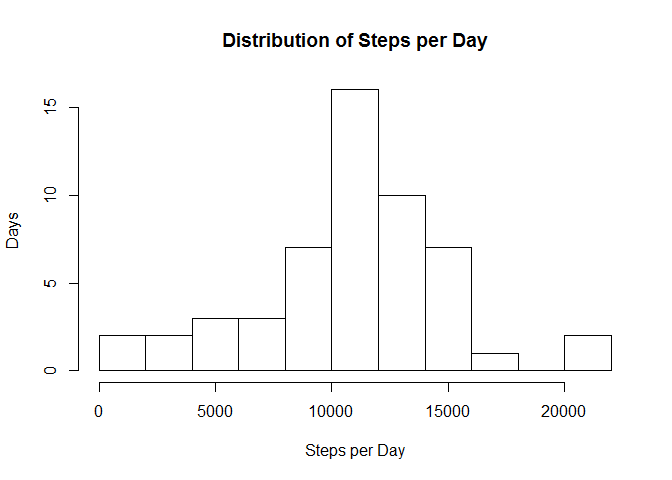
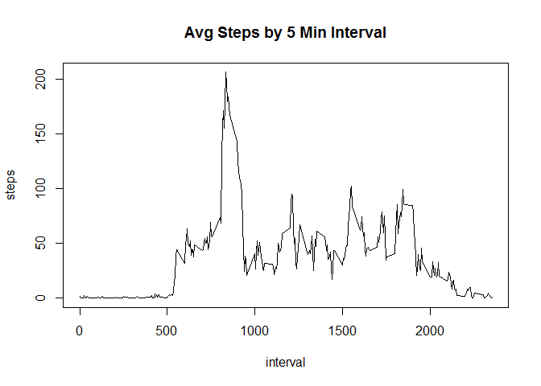
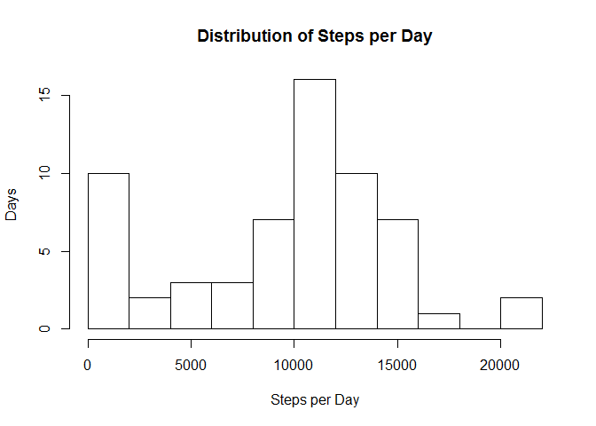
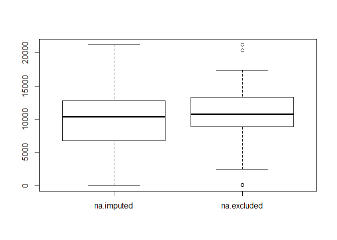
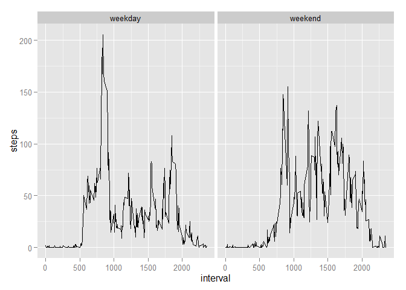

# Reproducible Research: Peer Assessment 1


## Loading and preprocessing the data

Fork the GitHub repo that contains all of the relevent data  
[Fork GitHub Repo](http://github.com/rdpeng/RepData_PeerAssessment1)

Unzip and load the data into R


```r
unzip("activity.zip")

activity <- read.csv("activity.csv",
                     header = TRUE,
                     sep = ","
                     )
```

Change dates to date data type

```r
require('lubridate')

activity$date <- ymd(activity$date)
```

## What is mean total number of steps taken per day?

Calculate Total 

```r
stepsbyday <- aggregate(list(steps = activity$steps),
                        by = list(date = activity$date),
                        FUN = sum
                        )
```

Histogram of daily step activity

```r
hist(stepsbyday$steps,
     breaks = 10, 
     main = 'Distribution of Steps per Day', 
     xlab = "Steps per Day",
     ylab = "Days"
     )
```

 

Summary of daily steps

```r
summary(stepsbyday$steps)
```

```
##    Min. 1st Qu.  Median    Mean 3rd Qu.    Max.    NA's 
##      41    8841   10760   10770   13290   21190       8
```

## What is the average daily activity pattern?

Calculate average steps per 5min interval

```r
stepsbymin <- aggregate(list(steps = activity$steps),
                        by = list(interval = activity$interval),
                        FUN = mean,
                        na.rm = T
                        )
```

And plot the results

```r
plot(stepsbymin,
     type = "l",
     main = "Avg Steps by 5 Min Interval")
```

 

Calculate the 5min interval with the most steps

```r
maxinterval <- stepsbymin[stepsbymin$steps == max(stepsbymin$steps),]
maxinterval
```

```
##     interval    steps
## 104      835 206.1698
```

## Imputing missing values

Calculate the number of NA values in the dataset

```r
sum(is.na(activity$steps))
```

```
## [1] 2304
```

Function for imputing the NA values and replacing them with the median for the interval

```r
imputemedian <- function(x) {
  #calculate median by interval
  stepsbyint <- aggregate(list(steps = activity$steps),
                          by = list(interval = activity$interval),
                          FUN = median,
                          na.rm = T
                          )
  #loop throug the values of the data (Probably should use an apply function)
  for(i in 1:nrow(x)){
      interval <- x$interval[i]
      if(is.na(x$steps[i])) {
      x$steps[i] = stepsbyint$steps[stepsbyint$interval == interval]
    }
  }
  imputemedian <- x
}
#Run the impute function on the data
activity.imp <- imputemedian(activity)
```

Calculate steps by day on the imputed data

```r
stepsbyday.imp <- aggregate(list(steps = activity.imp$steps),
                        by = list(date = activity.imp$date),
                        FUN = sum
                        )
```

Create histogram of imputed steps by day

```r
hist(stepsbyday.imp$steps,
     breaks = 10, 
     main = 'Distribution of Steps per Day', 
     xlab = "Steps per Day",
     ylab = "Days"
)
```

 

Compare mputed summary to excluded summary

```r
#Imputed NA
summary(stepsbyday.imp$steps)
```

```
##    Min. 1st Qu.  Median    Mean 3rd Qu.    Max. 
##      41    6778   10400    9504   12810   21190
```

```r
#Excluded NA
summary(stepsbyday$steps)
```

```
##    Min. 1st Qu.  Median    Mean 3rd Qu.    Max.    NA's 
##      41    8841   10760   10770   13290   21190       8
```

Plot a boxplot to show difference in imputed vs. exluded

```r
boxplot(list(na.imputed = stepsbyday.imp$steps,na.excluded = stepsbyday$steps))
```

 

## Are there differences in activity patterns between weekdays and weekends?

Add day of week to the activity data

```r
require('lubridate')
```

```
## Loading required package: lubridate
```

```
## Warning: package 'lubridate' was built under R version 3.1.3
```

```r
activity.imp$date <- ymd(activity.imp$date)
activity.wday <- cbind(activity.imp, dow = weekdays(activity.imp$date))
```

Create a function to determine if the day is a weekend or weekday

```r
wdays <- function(x){
  
  ifelse(tolower(x) %in% c("sunday", "saturday"),
         wdays <- "weekend",
         wdays <- "weekday"
  )
}

activity.wday$wd <- sapply(activity.wday$dow, FUN = wdays)
```

Aggregate the interval data by weekend and weekday

```r
stepsbyint.imp.wday <- aggregate(list(steps = activity.wday$steps),
                            by = list(interval = activity.wday$interval,
                                      wd = activity.wday$wd
                                      ),
                            FUN = mean
                            )
```


```r
#plot weekend vs. weekdays as line graph using ggplot2
require(ggplot2)
```

```
## Loading required package: ggplot2
```

```
## Warning: package 'ggplot2' was built under R version 3.1.3
```

```r
p.tmp <- ggplot(data = stepsbyint.imp.wday, aes(interval, steps)) +
                  geom_line()                 
p.tmp + facet_grid(. ~ wd)
```

 
